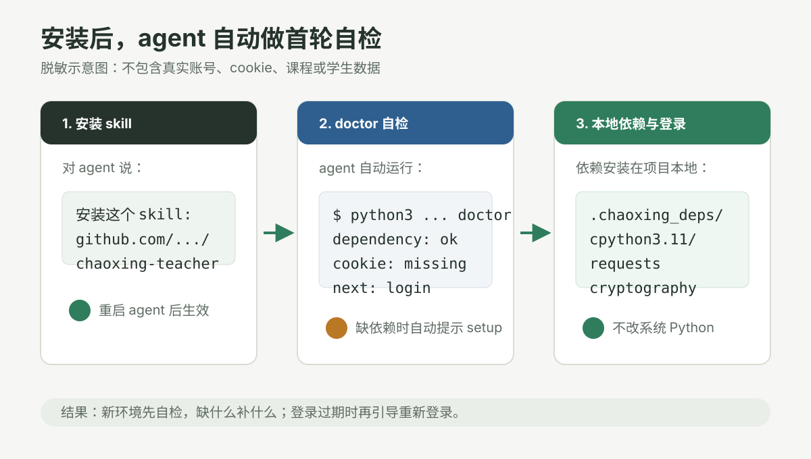
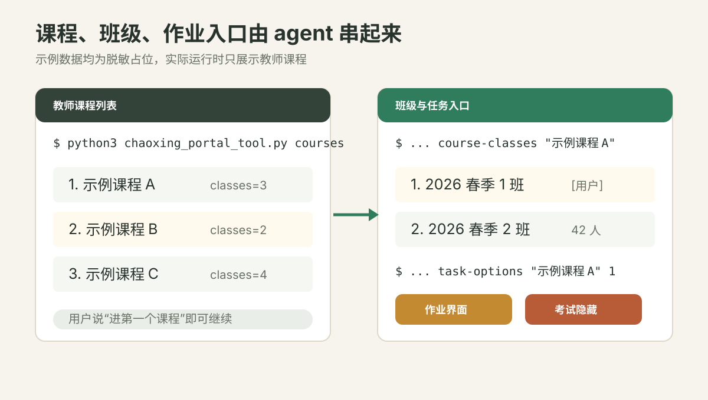
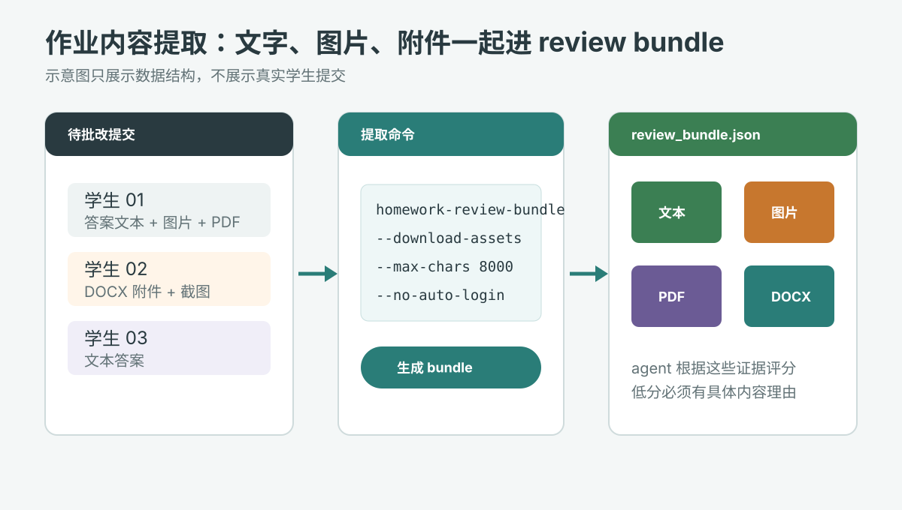
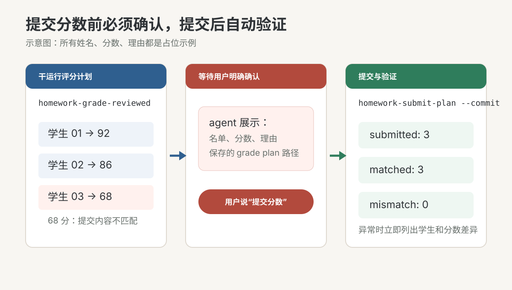

# Chaoxing Teacher Skill

超星/泛雅教师端 agent skill，用于教师课程查询、班级选择、作业内容提取、辅助评分、提交前确认和提交后验证。

## Install

把这个地址给支持 GitHub skill 安装的 agent：

```text
https://github.com/luoganzhi/chaoxing_teacher_tools/tree/main/chaoxing-teacher
```

例如可以直接对 agent 说：

```text
安装这个 skill：https://github.com/luoganzhi/chaoxing_teacher_tools/tree/main/chaoxing-teacher
```

安装后重启 agent，然后直接说：

```text
进入超星
```

或：

```text
帮我批改超星作业
```

agent 会按 skill 说明自动运行环境检查、依赖安装、登录检查和作业批改流程。

## Workflow Preview

下面是脱敏示意图，用来说明这个 skill 会替 agent 串起哪些步骤。图片不包含真实账号、cookie、学生姓名、课程 ID、成绩或作业内容。

### 1. 安装后先自检环境



agent 首次使用时会先运行 `doctor`，检查 Python、依赖、本地 cookie、可选浏览器工具和登录状态。缺少依赖时会提示运行 `setup`，依赖会安装到本地 `.chaoxing_deps/`，不改系统环境。

### 2. 选择教师课程和班级



登录后，agent 会先列出教师课程，再根据用户选择进入课程班级。班级列表会优先标记与当前用户相关的班级，任务入口当前只显示作业，考试功能保持隐藏。

### 3. 提取作业内容给 agent 参考



批改前会生成 review bundle。开启 `--download-assets` 后，学生答案里的图片和附件会下载到本地，PDF/DOCX/TXT 等附件会尽量提取文本，agent 可以结合图片路径、附件元数据和文本证据给分。

### 4. 提交前确认，提交后验证



评分会先生成干运行计划，展示学生、分数和理由。只有用户明确说“提交分数”后才会执行 `--commit`，提交后会重新读取超星页面验证分数是否匹配。

## Why This Path

这个仓库的可安装 skill 在 `chaoxing-teacher/` 子目录里。该目录包含完整运行所需文件：

- `SKILL.md`
- `chaoxing_portal_tool.py`
- `chaoxing_portal_tool.md`
- `chaoxing_browser_check.py`
- `chaoxing_cookie_check.py`
- `requirements.txt`

不要只复制 `SKILL.md`。这个 skill 需要本地脚本来稳定登录、拉取课程、下载作业图片/附件、生成评分计划和提交后验证。

## First Use

用户通常不需要手动跑这些命令；agent 会根据 skill 执行。首次环境大致流程是：

```bash
python3 chaoxing_portal_tool.py doctor
python3 chaoxing_portal_tool.py setup
python3 chaoxing_portal_tool.py doctor --check-login
python3 chaoxing_portal_tool.py login
```

`setup` 会把依赖安装到本地 `.chaoxing_deps/cpythonX.Y/`，不修改系统 Python。

## Capabilities

- 只列出教师课程和班级
- 查找待批改作业
- 提取学生答案文本
- 下载答案图片和附件
- 提取 PDF/DOCX/TXT 等附件文本
- 根据内容生成干运行评分计划
- 用户确认后提交分数
- 提交后重新验证分数是否写入

考试功能当前隐藏/禁用。

## Safety

- 不打印密码或 cookie
- 不提交 `.chaoxing_cookies.json`
- 不提交 `.chaoxing_grade_plans/`
- 不提交 `.chaoxing_review_bundles/`
- 不公开学生作业附件、图片和成绩文件
- 没有用户明确确认，不执行带 `--commit` 的提交命令

## Manual CLI

如果不通过 agent skill 使用，也可以手动 clone 后运行：

```bash
git clone https://github.com/luoganzhi/chaoxing_teacher_tools.git
cd chaoxing_teacher_tools/chaoxing-teacher
python3 chaoxing_portal_tool.py doctor
python3 chaoxing_portal_tool.py setup
python3 chaoxing_portal_tool.py login
python3 chaoxing_portal_tool.py courses
```

更多命令见：

- `chaoxing-teacher/chaoxing_portal_tool.md`
- `python3 chaoxing_portal_tool.py --help`
